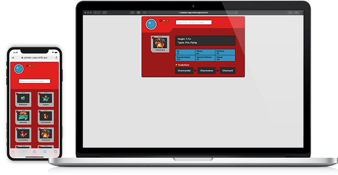

# React Pokedex

## Run locally

To run the game locally in development mode, just clone the repository and run `yarn start`

You can also use `npm`, just make sure to delete your `yarn.lock` file, otherwise you might have some complaining.

## Testing

To run all test in watch mode (they will re-run on every change), you can run `yarn test`.

## Building

To run a local production build you can run `yarn deploy`. It runs all tests and builds the application if they pass. If you want to skip the tests, you can run `yarn build` directly.

The app also has automated build & deployment using Netlify. It runs on every commit that is pushed to `master`.
